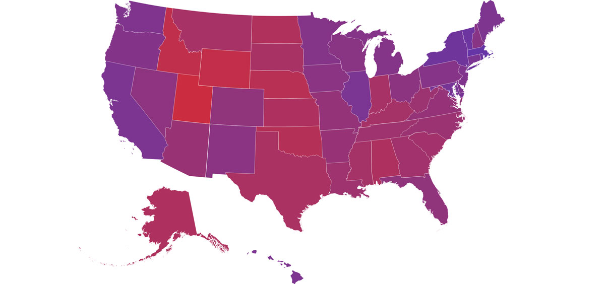

# Purple States

https://geealbers.github.io/purple-states/

*Traditional U.S. electoral maps not only illustrate polarization, they can exacerbate it. States are not strictly red and blue, they are shades of purple.*

---

In the United States, no state ever votes 100% Democratic (blue) or 100% Replublican (red), and yet this is how we are most accustomed to seeing our electoral maps illustrated. Such as this one from 2004:

Authors of [a 2009 study](https://doi.org/10.1111/j.1530-2415.2009.01183.x) proposed an alternate version of the standard electoral map using proportional shades of purple. States that voted more Democratic were bluer shades of purple, and states that voted more Republican were redder shades of purple, all depending on the percentages of the total vote. Here’s 2004 again:

Not only did this more accurately reflect the full, nuanced spectrum of the country’s political standings (as opposed to the winner-take-all system of the broken electoral college) but it was shown that it decreased study participants’ perceptions of political polarization. The researchers demonstrated that the flipside was also true. Looking at those strict red and blue maps makes us believe that the country is more polarized than it actually is.

[On this site](https://geealbers.github.io/purple-states/), I've collected [state-by-state data](https://docs.google.com/spreadsheets/d/1srbBVuDko3WbCrl9WTTkYJUX5OUKACsDY4t1S95inVk/edit?usp=sharing) from the last forty years of U.S. presidential elections and proportionally colored the electoral map in shades of purple.

I built this the day after [the 2020 election](https://en.wikipedia.org/wiki/2020_United_States_presidential_election), before the final winner was announced. After four years of national trauma under the 45th president, it was baffling and sickening that the contest was as close as it was. Still, I was compelled to look for sollace, answers, hope anywhere. The purple map helped me. Helped me to remember that just because a state is “red” doesn’t mean it’s fully that way. To remember that flipping another one may not be that far off after all. To remember that we need to fight the polarization that electoral maps, traditional and social media, and so many other things seems to push us toward these days.

## Credits

Rutchick, Abraham M., Joshua M. Smyth, and Sara Konrath, “Seeing Red (and Blue): Effects of Electoral College Depictions on Political Group Perception”, *Analysis of Social Issues and Public Policy*: Vol. 9, No. 1, November 24, 2009. https://doi.org/10.1111/j.1530-2415.2009.01183.x

Mason, Betsy, “Election Maps Are Everywhere. Don’t Let Them Fool You.” *New York Times*, October 30, 2020. https://www.nytimes.com/interactive/2020/10/30/opinion/election-results-maps.html

Map data was pulled from Wikipedia pages and culled in a Google Sheet: https://docs.google.com/spreadsheets/d/1srbBVuDko3WbCrl9WTTkYJUX5OUKACsDY4t1S95inVk/edit?usp=sharing. I used only the totals of votes for the Democratic and Replublican party candidates. Third party candidates were not factored in.

Vector map of the United States: https://freevectormaps.com/united-states/US-EPS-01-0002.

Reload and Information icons: https://material.io/resources/icons/?search=replay&style=baseline

## License

© Greg Albers, 2020

This site is licensed under a [Creative Commons Attribution-NonCommercial 4.0 International License](https://creativecommons.org/licenses/by-nc/4.0/). Please feel free to share, re-mix, and re-use it with attribution for non-commerical purposes.
